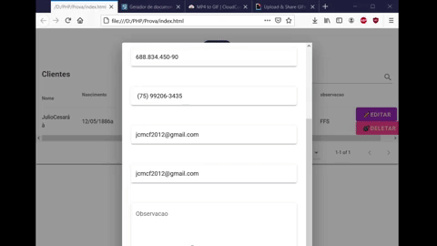

# Sistema CRUD em Vue.js

<h4>Um CRUD de usuários simples utilizando Vue.js, Vuetify, Html CSS JS, PHP e MYSQL</h4>

## Conteúdo
* [Informações](#informações)
* [Tecnologias](#tecnologias)
* [Como Rodar](#Rodando)
* [Próximos Passos](#PróximosPassos )

## Informações
:green_book:
Esse projeto foi feito utilizando o framework vue.js, com o banco de dados mysql,
e seu backend configurado em PHP. 

## Tecnologias

:computer: Projeto foi criado utilizando:
* PHP version: 8.0.3
* Vue.js version: 2.0
* Axios version: 0.21.1
* SweetAlert version: 10.0.2
* Google Fonts
* Vuetify version: 2.x

## Rodando
:ferris_wheel: 
1- Para rodar o projeto, crie uma pasta de nome crud em htdocs do xampp e depois
coloque os arquivos php nos htdocs do xampp. Abra o servidor do xampp e
execute o sql da pasta do projeto.  
2- Vá ao arquivo conexão.php e edite os campos DIGITE AS SUAS CREDENCIAIS 
com as credenciais do seu mysql. 
3- Depois Rode o arquivo estático index.html, ele vai fazer a comunicação com o localhost
servido pelos arquivos php. 

## PróximosPassos 
:bug: 
1- Adicionar máscaras ao formulário de edição e criação de clientes. 

2- Refatorar os arquivos para utilizar em um projeto Vue.js feito com
nodejs por meio do npm.

 
